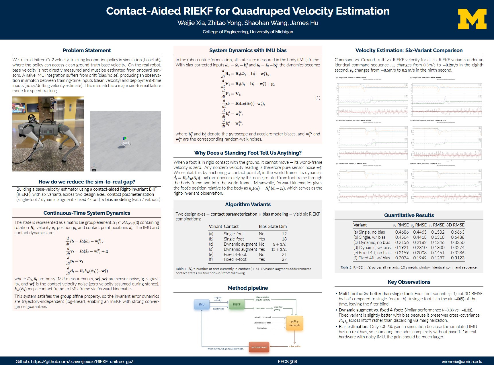
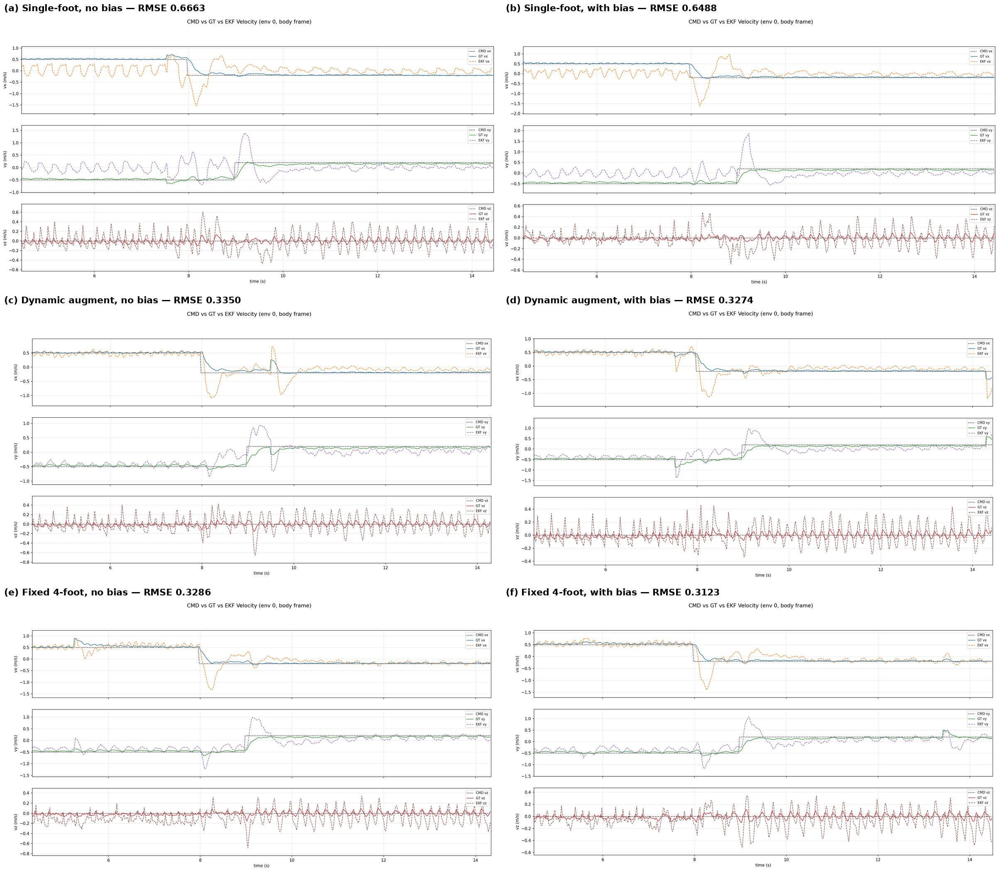

# Contact-Aided RIEKF for Quadruped Velocity Estimation

Six RIEKF variants for velocity estimation on a Unitree Go2 quadruped in Isaac Lab, based on Hartley et al. [1].

Tested on Isaac Lab 0.54.2 + Isaac Sim 5.1.0, verified on both DGX Spark (Linux aarch64) and Windows (x86_64).

For environment setup, please refer to [Unitree RL Lab](https://github.com/unitreerobotics/unitree_rl_lab).

The complete math formulation of RIEKF is in RIEKF_formulation.pdf

## Algorithm Variants

Two design axes — **contact parameterization** × **bias modeling** — yield six combinations:

| File | Contact | Bias | State Dim | Description |
|------|---------|------|-----------|-------------|
| `play_base_plot_one.py` | Single-foot | No | 12 | Only FL_foot, fixed single anchor |
| `play_bias_plot_one.py` | Single-foot | Yes | 18 | Single-foot + online bg, ba estimation + contact management |
| `play_base_plot.py` | Dynamic | No | 9+3Nc | Hartley original: augment on touchdown, marginalize on liftoff |
| `play_bias_plot.py` | Dynamic | Yes | 15+3Nc | Dynamic contacts + online bg, ba estimation |
| `play_base_4foots.py` | Fixed | No | 21 | All 4 anchors always in state, P dimension constant |
| `play_bias_4foot.py` | Fixed | Yes | 27 | Fixed 4-foot + online bg, ba estimation |

Nc = number of feet currently in contact (0–4).

## Results

All variants evaluated under an identical fixed command sequence (vx=0.5, vy=-0.5 m/s for 8s, then step changes) over a 10s metric window.



| Variant | vx RMSE | vy RMSE | vz RMSE | **3D RMSE** |
|---------|---------|---------|---------|-------------|
| (a) Single-foot, no bias | 0.4686 | 0.4465 | 0.1582 | **0.6663** |
| (b) Single-foot, with bias | 0.4564 | 0.4418 | 0.1318 | **0.6488** |
| (c) Dynamic augment, no bias | 0.2156 | 0.2182 | 0.1346 | **0.3350** |
| (d) Dynamic augment, with bias | 0.1921 | 0.2310 | 0.1300 | **0.3274** |
| (e) Fixed 4-foot, no bias | 0.2159 | 0.2008 | 0.1451 | **0.3286** |
| (f) Fixed 4-foot, with bias | 0.2074 | 0.1949 | 0.1287 | **0.3123** |

### Key observations

**Single-foot vs multi-foot**: Using all four feet (c–f) roughly halves the 3D RMSE compared to single-foot (a–b). In trot gait, a single foot only provides observations ~50% of the time; multi-foot variants maintain near-continuous observation coverage.

**Dynamic augment vs fixed 4-foot**: Performance is comparable (0.33 vs 0.33 for base, 0.33 vs 0.31 for bias). The fixed variant is slightly better with bias, likely because it preserves cross-covariance information across liftoff/touchdown transitions rather than discarding it via marginalization.

**Base vs bias**: Adding bias estimation yields marginal improvement in simulation (~3–5%) because the simulated IMU has no true bias. The "imperfect" InEKF linearization cost (state-dependent At) partially offsets the benefit. On real hardware with significant IMU bias, the tradeoff is expected to reverse.

**vz dominates relative error**: All variants show relative RMSE > 3.0 in vz due to touchdown impact transients, while vx/vy relative RMSE stays below 0.6 for multi-foot variants.

## Training

```bash
python train.py --task Unitree-Go2-Velocity --num_envs 4096 --headless --max_iterations 50000
```

A pre-trained checkpoint `model_49999.pt` is included in the repository root. This is an RSL-RL PPO checkpoint at iteration 49999, containing actor (obs 45 → 512 → 256 → 128 → 12 actions) and critic (obs 60 → 512 → 256 → 128 → 1 value) networks with optimizer state.

## Evaluation

```bash
# Single-foot, no bias
python scripts/rsl_rl/play_base_plot_one.py --task Unitree-Go2-Velocity --checkpoint model_49999.pt --num_envs 1

# Single-foot, with bias
python scripts/rsl_rl/play_bias_plot_one.py --task Unitree-Go2-Velocity --checkpoint model_49999.pt --num_envs 1

# Dynamic augment, no bias
python scripts/rsl_rl/play_base_plot.py --task Unitree-Go2-Velocity --checkpoint model_49999.pt --num_envs 1

# Dynamic augment, with bias
python scripts/rsl_rl/play_bias_plot.py --task Unitree-Go2-Velocity --checkpoint model_49999.pt --num_envs 1

# Fixed 4-foot, no bias
python scripts/rsl_rl/play_base_4foots.py --task Unitree-Go2-Velocity --checkpoint model_49999.pt --num_envs 1

# Fixed 4-foot, with bias
python scripts/rsl_rl/play_bias_4foot.py --task Unitree-Go2-Velocity --checkpoint model_49999.pt --num_envs 1
```

Each script outputs a real-time plot (CMD vs GT vs EKF) and a metric file `velocity_metrics_*.txt`.

## References

[1] R. Hartley, M. Ghaffari, R. M. Eustice, and J. W. Grizzle, "Contact-Aided Invariant Extended Kalman Filtering for Robot State Estimation," *Int. J. Robotics Research*, 39(4), 2020.